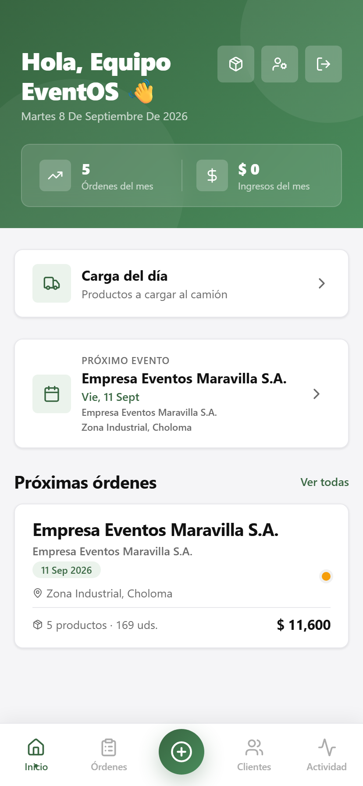
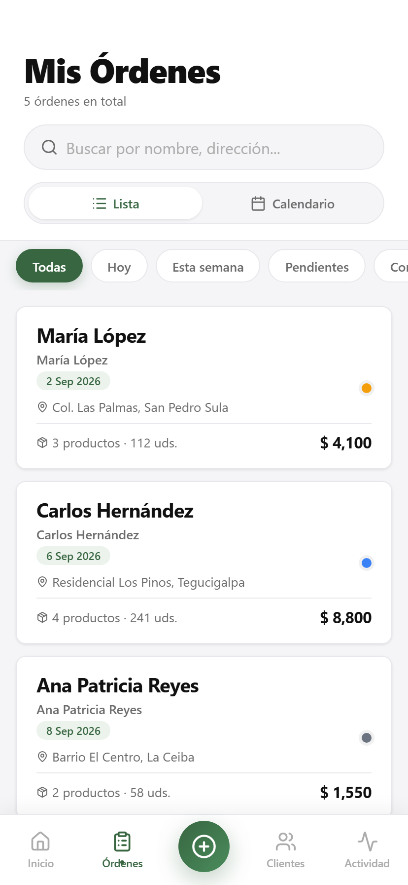
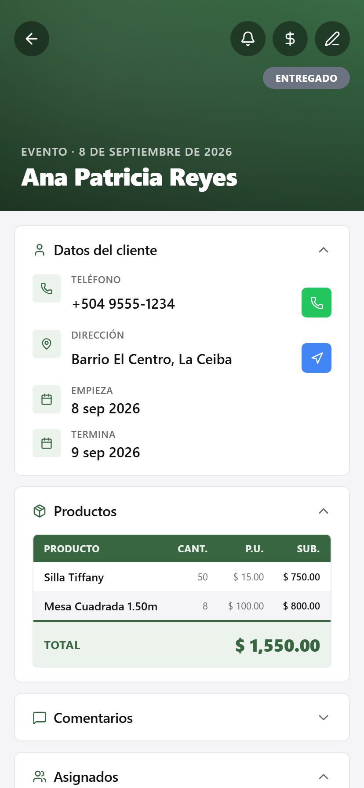
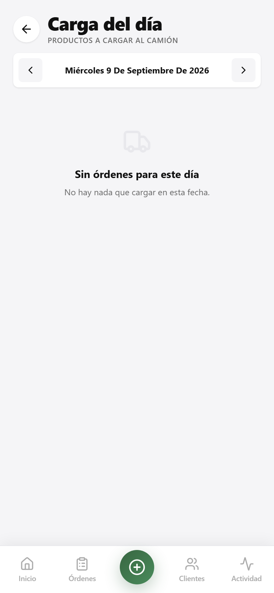
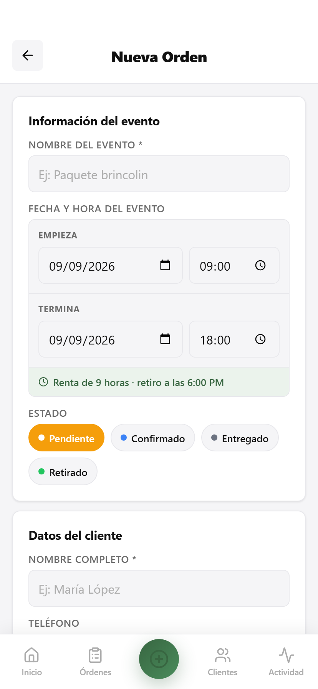
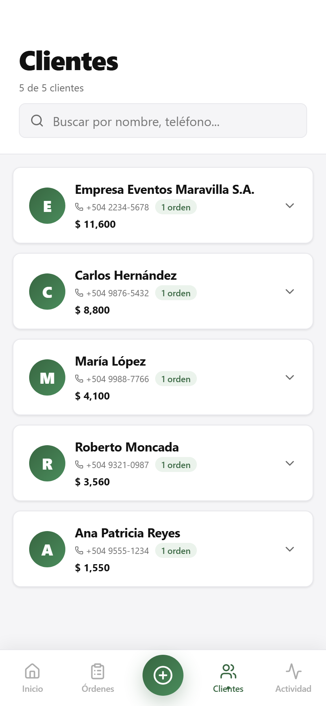
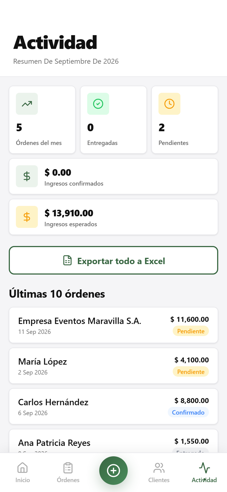

<div align="center">

# EventOS

### La agenda del alquiler de mobiliario, en el bolsillo

[](LICENSE)
[](https://react.dev/)
[](https://vite.dev/)
[](https://web.dev/progressive-web-apps/)

Órdenes de alquiler para eventos —sillas, mesas, carpas y tarimas— con la
agenda, la carga del camión y la exportación a Excel y PDF. Instalable como
app y con soporte sin conexión.

</div>

<div align="center">



</div>

## Qué resuelve

Un negocio de alquiler de mobiliario coordina cada fin de semana lo mismo: qué
evento hay, qué se lleva, quién lo recibe y cuándo se retira. Eso vive en un
cuaderno o en un grupo de WhatsApp, y el día del evento alguien tiene que
recordar cuántas sillas caben en el camión.

EventOS convierte esa coordinación en una app que se usa **de pie, con una
mano y sin señal**: se abre la orden en el terreno, se marca entregado y se
sincroniza cuando vuelve la conexión.

| | |
| --- | --- |
| **Órdenes** | Crear, editar y mover entre pendiente, confirmado y entregado |
| **Agenda** | El próximo evento y las órdenes que vienen, por fecha |
| **Carga del día** | Los productos que hay que subir al camión hoy, sumados |
| **Detalle** | Cliente, dirección, comentarios del terreno, ítems y total |
| **Fotos** | Evidencia por orden |
| **Clientes** | Listado consolidado a partir de las órdenes |
| **Actividad** | Quién creó o modificó cada orden y cuándo |
| **Exportación** | Excel (.xlsx) y PDF |
| **Roles** | Administración, staff y reparto |
| **Sin conexión** | PWA instalable en Android e iOS, con Workbox |

## Cómo se ve

<table>
<tr>
<td width="33%"></td>
<td width="33%"></td>
<td width="33%"></td>
</tr>
<tr>
<td align="center"><b>Carga del día</b><br>lo que sube al camión</td>
<td align="center"><b>Nueva orden</b><br>alta en el terreno</td>
<td align="center"><b>Clientes</b><br>desde las órdenes</td>
</tr>
</table>

<div align="center">


**Actividad** — la auditoría de quién tocó qué
</div>

> Las capturas salen del modo de datos ficticios: ningún cliente, dirección ni
> monto corresponde a nadie real.

## Stack

| Capa | Tecnología |
|---|---|
| Interfaz | React 19 + TypeScript |
| Empaquetado | Vite 8 |
| Rutas | React Router v7 |
| Backend | Firebase v12 — Auth, Firestore, Storage |
| PWA | vite-plugin-pwa + Workbox |
| Estilos | CSS Modules y variables CSS |
| Exportación | @react-pdf/renderer, xlsx |
| Iconos | lucide-react |

## Probarlo sin Firebase

La forma más rápida de ver la app funcionando: **no necesita credenciales**.

```bash
git clone https://github.com/esdrasclth/event-os.git
cd event-os
npm install
```

En `src/data/seed.ts`, activa los datos ficticios:

```ts
export const USE_MOCK_DATA = true;
```

```bash
npm run dev     # http://localhost:5173
```

Carga cinco órdenes de ejemplo en memoria, sin tocar Firebase.

> ⚠️ El interruptor cubre los datos, **no la autenticación**: el login sigue
> yendo a Firebase Auth. Para recorrer la app sin cuenta hace falta además
> saltarse `AuthContext`.

## Configurar Firebase

`.env.local` en la raíz, con `.env.example` como plantilla:

```env
VITE_FIREBASE_API_KEY=
VITE_FIREBASE_AUTH_DOMAIN=
VITE_FIREBASE_PROJECT_ID=
VITE_FIREBASE_STORAGE_BUCKET=
VITE_FIREBASE_MESSAGING_SENDER_ID=
VITE_FIREBASE_APP_ID=
```

Los valores salen de **Firebase Console → Configuración del proyecto → Tus
aplicaciones → Web**.

En la consola de Firebase: habilita **Authentication** con proveedor
Email/Password, crea **Firestore** y habilita **Storage**. Reglas mínimas de
Firestore:

```
rules_version = '2';
service cloud.firestore {
  match /databases/{database}/documents {
    match /ordenes/{ordenId} {
      allow read, write: if request.auth != null;
    }
  }
}
```

Por último, en `src/data/seed.ts` deja `USE_MOCK_DATA = false`.

## Estructura

```text
src/
  components/   BottomNav, OrdenCard, FilterChips, CollapseSection, ItemRow
  contexts/     AuthContext, OrdenesContext, ProductosContext, UsersContext
  data/         seed.ts — datos ficticios y el interruptor USE_MOCK_DATA
  hooks/        useOrdenes, useOrden
  pages/        Home, Ordenes, DetalleOrden, NuevaOrden, CargaDelDia,
                Clientes, Actividad, Login
  services/     firebase.ts, exportExcel.ts, exportPdf.tsx
  types.ts      Orden, ItemOrden, EstadoOrden, AppUser, UserRole
docs/capturas/  imágenes de este README
```

## Scripts

| Comando | Qué hace |
|---|---|
| `npm run dev` | Servidor de desarrollo |
| `npm run build` | Compilación de producción |
| `npm run preview` | Sirve lo compilado |
| `npm run lint` | ESLint |

## Contribuir

[`CONTRIBUTING.md`](CONTRIBUTING.md) explica el entorno, las convenciones y qué
comprobar antes de un pull request.

## Licencia

Software propietario. Copyright (c) 2026 Esdras Clother / Brandsofts. El código
es visible para lectura y estudio; **no se concede licencia de uso**. Ver
[`LICENSE`](LICENSE).
